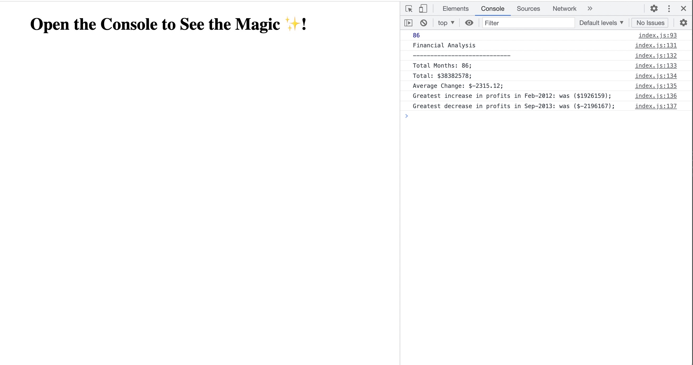

## Console Finances

# Description

In this project i was tasked with creating code for analyzing the financial records of a company. Some values i was tasked to log was the total amount of months, total earnings, average change from month to month,greatest month for income and least greatest month for income.

# Deployed Link
https://ellaflo.github.io/console-finances/

# Repository Link is the source code
https://github.com/ellaflo/console-finances

# Installation
N/A

# Usage

# Credits
N/A

# License
Please refer to the LICENSE in the repo.
